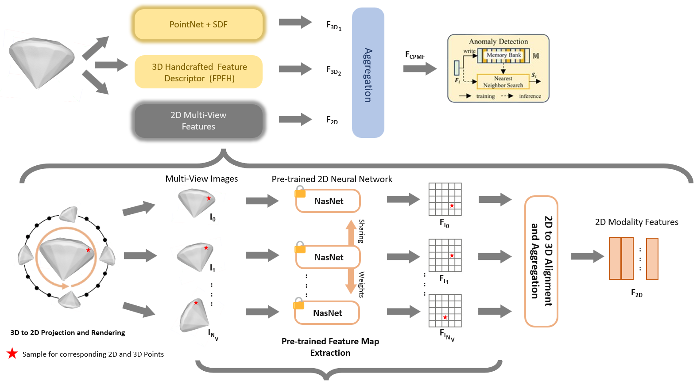
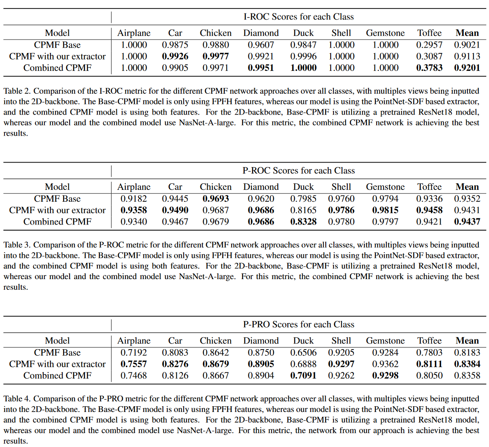

# Enhanced:  Complementary Pseudo Multimodal Feature for Point Cloud Anomaly Detection - Malaz Tamim
### [Base Paper:](https://arxiv.org/abs/2303.13194)
Base paper rankings as of 2024-02-07

[](https://paperswithcode.com/sota/depth-anomaly-detection-and-segmentation-on?p=complementary-pseudo-multimodal-feature-for)

[](https://paperswithcode.com/sota/3d-anomaly-detection-and-segmentation-on?p=complementary-pseudo-multimodal-feature-for)


## Introduction
We are a team of three pursuing our Master of Science at the Technical University of Munich. This project work involved choosing a recently published research in domain of 3D anomaly detection. Hence, we took up the base CPMF paper, and added a few modifications to its pipeline. Some of the modifications have  been inspired by [Shape-Guided](https://openreview.net/pdf?id=IkSGn9fcPz) and [Neural-Pull](https://arxiv.org/pdf/2011.13495.pdf).




## Enhancements to the Base CPMF Network

Below, we detail the significant enhancements introduced to the base CPMF network:
1. Integration of PointNet and PointNet++ for preliminary 3D modality feature extraction, marking a shift towards deep learning techniques.
2. Deployment of a super-resolution Signed Distance Field (SDF) Network to refine the extraction of 3D features, enhancing the network’s spatial understanding.
3. Integration of a noising and patching process, devised to enrich the learning of local geometries within high-resolution point clouds.
4. Reworking of the final feature aggregation module, enabling a three-stage rich feature fusion.
5. Substitution of the pretrained ResNet 2D backbone with NasNet, selected for its superior performance in imageNet-1k (which it is pretrained on).


## Cloning & Setup

1.  Clone our GitHub repo:
```bash
git https://github.com/MalazTamim/Enhanced-CPMF
cd Enhanced-CPMF
```

2. Create a new conda environment to install the required libraries:
```bash
conda create -n 3d_Ecpmf python=3.7
conda activate 3d_Ecpmf
sh init.sh
```

3. Download the [RealAD-3D dataset](https://github.com/M-3LAB/Real3D-AD), RealAD-3D Multiview Dataset(generated from the pipeline here) and the pretrained checkpoints:
```bash
RealAD dataset : https://drive.google.com/file/d/1S3ul2qNNSiV_JZmhPj_-U0ZbO2TdVN30/view?usp=sharing
RealAD-3D Multiview Dataset : https://drive.google.com/file/d/10SbU9AKNQQyIlT5Q0MkvRaUlhvxHpiry/view?usp=sharing
Pretrained Checkpoints : https://drive.google.com/file/d/1FTcZnUkwrL8H--xBFQY2z3esVCuwR_ZX/view?usp=sharing
```


4. Extract the downloaded dataset, Multiview dataset and checkpoints in such file structure:
```bash
--Enhanced-CPMF/

        -datasets/Real_AD_3D

        -datasets/Real_AD_3D_multi_view

        -checkpoint_pointnet/

        .
        .
        .

        - run_main.sh
```


## Preprocessing & Multiview Generation
If you downloaded the multi_view dataset in the last step already, skip this step, this step only needs to be done once.

1. Running the Preprocessing for all the available classes:
```bash
sh preprocess_dataset.sh
```

## Training
If you downloaded the pretrained model checkpoints in the cloning & setup step, skip this step.

1. Training the Pointnet & SDF Network for every class:
```bash
sh run_train.sh
```

The training arguments are in train.py if you feel to change them.


## Inference
This will build the memory bank in the first stage, and would then go on to detect 3D pointcloud anomalies.

1. Inference with the Pointnet & SDF Network for every class:
```bash
sh run_main.sh.sh
```

Note : 
- Large amount of CPU RAM is required to run this step with the default 2D backbone, switch to ResNet if low on memory. Furthermore, Linux users can create a SWAP file to increase the CPU memory.
- Metrics would be stored by default in results/csv/deafult.csv


## Results
Three evaluation metrics are employed in this study. Image-level anomaly detection is assessed through the image-level ROC (I-ROC).

For anomaly segmentation at the pixel level, two metrics are utilized:

1. Pixel-wise ROC (P-ROC), an extension of the standard ROC for pixel-level analysis. This approach considers each pixel in the dataset as an individual sample, calculating the ROC over all pixels in the dataset.

2. The PRO metric, represented as P-PRO, is defined as the average relative overlap of the binary prediction P with each ground truth connected component Ck, where K signifies the number of ground truth components. The final metric is obtained by integrating this curve up to a specified false positive rate and normalizing using an integration limit of 0.3.
    


